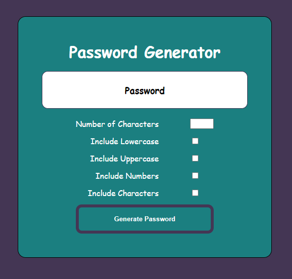

# Password Generator

Root folder contains:

* README.md      (Read Me File)
* index.html     (Password Generator Page)
* \Assets\       (CSS and Images Folder)
*   \JS\        (Folder that hold the javascript.js file)
*   \CSS\       (Folder that holds CSS)

## Description
A simple password generator that will provide random characters anywhere from 8-128 characters long. The user will choose the length of the password and what type of characters will be included in the password.

## Usage
* User will be required to enter a number (or use up/down arrows in input box) 
between 8-128 which will decide the length of the password.

* User selects the checkbox to determine what type of characters to use within the password. (at least 1 must be selected or you will be sent an alert)

* User clicks the "Generate Password" button and the white box will display the users newly generated password.

* User can change any of the checkboxes at any time and also change the number of characters at any time and repress the button to generate a new password.

## Visuals
<a href="https://bbrintle.github.io/3-Password-Generator/">Visit Site</a>
 

## Resources Used
Bootstrap
 
Javascript
 
HTML/CSS

## Authors
This was created by Blake Brintle. 
 
blakebrintle@gmail.com
 
<a href="https://bbrintle.github.io/">Blake's Site</a>

## License
MIT

- - -